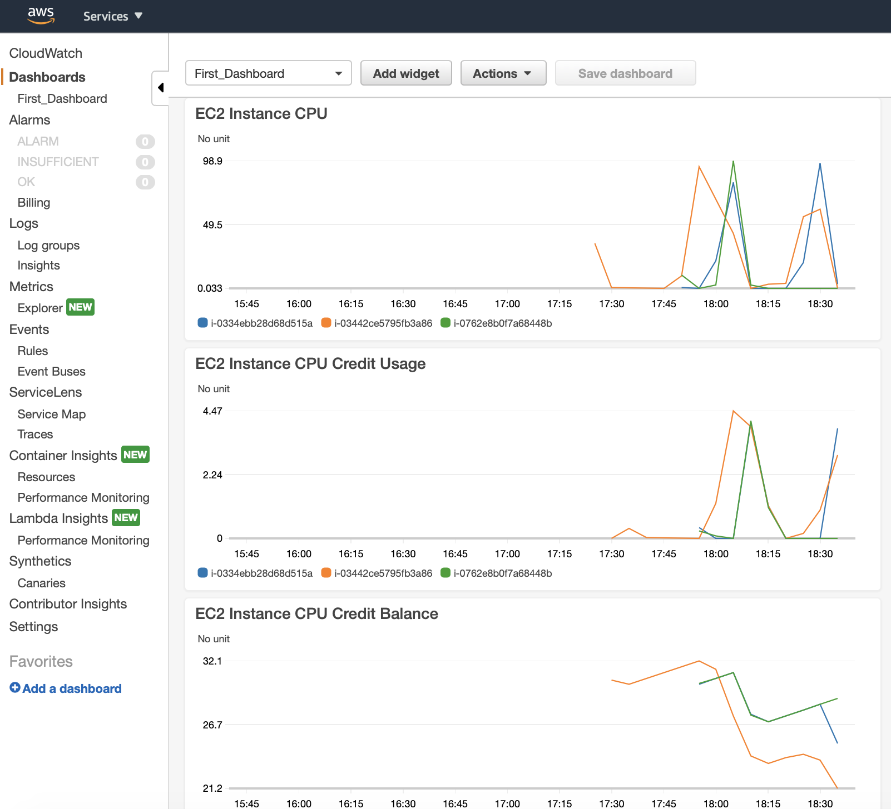

# Cloudwath Dashboards

Deploy three EC2 instances and monitor them through a Cloudwatch dashboard. Run some stress test to see CPU usage and CPUcredit usage.

| Resource | Estimated cost (without VAT) | Link |
|------|---------|---------|
| EC2 | 0,013 $/h x # of instances | [Pricing](https://aws.amazon.com/ec2/pricing/on-demand/) |
| Cloudwatch | you can easely remain in the free tier | [Pricing](https://aws.amazon.com/cloudwatch/pricing/) |

| Automation | Time |
|------|---------|
| Time to deploy (Terraform) | 2 min |
| Time to deploy (Ansible) | 30 sec |
| Time to destroy | 1 min |

# Useful link

[Customize CloudWatch widget](https://docs.aws.amazon.com/AmazonCloudWatch/latest/APIReference/CloudWatch-Dashboard-Body-Structure.html)

[stress e stress-ng suite](https://www.cyberciti.biz/faq/stress-test-linux-unix-server-with-stress-ng/)

