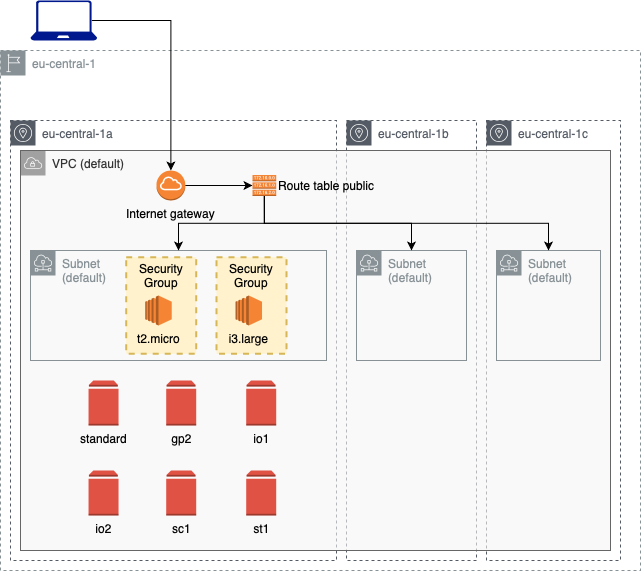

# EBS test

Deploy an EC2 instance and several EBS volumes to test them.



| Resource | Estimated cost (without VAT) | Link |
|------|---------|---------|
| Total | 1,15 $/h | [Pricing](https://aws.amazon.com/ec2/pricing/on-demand/) |
| EC2 t2.micro | 0,013 $/h | [Pricing](https://aws.amazon.com/ec2/pricing/on-demand/) |
| EC2 i3.large | 0,18 $/h | [Pricing](https://aws.amazon.com/ec2/pricing/on-demand/) |
| EBS gp2 | 0,0026 $/h for 16GB (example) | [Pricing](https://aws.amazon.com/ebs/pricing/) |
| EBS io2 | 0,72 $/h for 128GB and 6.400 IOPS (example) | [Pricing](https://aws.amazon.com/ebs/pricing/) |
| EBS io1 | 0,18 $/h for 32GB and 1.600 IOPS (example) | [Pricing](https://aws.amazon.com/ebs/pricing/) |
| EBS st1 | 0,0375 $/h for 500GB (minimum size) | [Pricing](https://aws.amazon.com/ebs/pricing/) |
| EBS sc1 | 0,0125 $/h for 500GB (minimum size) | [Pricing](https://aws.amazon.com/ebs/pricing/) |

| Automation | Time |
|------|---------|
| Time to deploy (Terraform) | 1 min 30 sec |
| Time to deploy (Ansible) | 30 sec |
| Time to destroy | 1 min 30 sec |

## Useful links

[Work with volumes](https://docs.aws.amazon.com/AWSEC2/latest/UserGuide/ebs-using-volumes.html)

[Test Volumes](https://docs.cloud.oracle.com/en-us/iaas/Content/Block/References/samplefiocommandslinux.htm)

## Usage

### Set up environment

Generete your [public ssh key](https://www.ssh.com/ssh/keygen/) and update `main.tf` file with your `id_rsa.pub` in the field `public_key` of the `aws_key_pair` resource.

Now you can deploy the ec2 and the db instance with terraform.

### Deploy

To run this example you need to execute:

```
$ terraform init
$ terraform plan
$ terraform apply
```

Note that this example may create resources which can cost money. Run `terraform destroy` when you don't need these resources.

### Deploy test suite and mount disk

Choose which EBS volume you want to test in the `configure_volumes.yml` file.

```
ansible-playbook -i ./ec2.py ./configure_volumes.yml -l tag_Name_public_server
```

Login on your EC2 instance and run the `lsblk` command. You should see something like this:

```
NAME    MAJ:MIN RM  SIZE RO TYPE MOUNTPOINT
loop0     7:0    0   31M  1 loop /snap/snapd/9721
loop1     7:1    0 55.4M  1 loop /snap/core18/1932
loop2     7:2    0 67.8M  1 loop /snap/lxd/18150
loop3     7:3    0 28.1M  1 loop /snap/amazon-ssm-agent/2333
xvda    202:0    0    8G  0 disk
└─xvda1 202:1    0    8G  0 part /
xvdf    202:80   0   16G  0 disk
xvdg    202:96   0   16G  0 disk
xvdh    202:112  0   32G  0 disk
xvdi    202:128  0  128G  0 disk
xvdl    202:176  0  500G  0 disk
xvdm    202:192  0  500G  0 disk /mnt/data
```

If you want to test IOPS you can run the following command:
```
sudo fio --filename=/mnt/data/test --size=9GB --direct=1 --rw=randrw --bs=4k --ioengine=libaio --iodepth=256 --runtime=120 --numjobs=4 --time_based --group_reporting --name=iops-test-job --eta-newline=1
```
At the end of the test you will see these results:
```
iops-test-job: (groupid=0, jobs=4): err= 0: pid=5864: Tue Nov 17 20:52:07 2020
  read: IOPS=64, BW=258KiB/s (265kB/s)(30.4MiB/120510msec)
    slat (usec): min=3, max=629728, avg=24421.29, stdev=46263.44
    clat (msec): min=438, max=10672, avg=7460.18, stdev=1367.54
     lat (msec): min=492, max=10672, avg=7484.60, stdev=1369.79
    clat percentiles (msec):
     |  1.00th=[ 1636],  5.00th=[ 5201], 10.00th=[ 6074], 20.00th=[ 6745],
     | 30.00th=[ 7080], 40.00th=[ 7349], 50.00th=[ 7617], 60.00th=[ 7886],
     | 70.00th=[ 8154], 80.00th=[ 8423], 90.00th=[ 8926], 95.00th=[ 9194],
     | 99.00th=[ 9731], 99.50th=[10000], 99.90th=[10402], 99.95th=[10537],
     | 99.99th=[10671]
   bw (  KiB/s): min=   29, max=  992, per=100.00%, avg=260.57, stdev=37.65, samples=893
   iops        : min=    5, max=  248, avg=64.74, stdev= 9.41, samples=893
  write: IOPS=67, BW=269KiB/s (275kB/s)(31.7MiB/120510msec); 0 zone resets
    slat (usec): min=3, max=629714, avg=35788.72, stdev=60643.35
    clat (msec): min=377, max=10891, avg=7662.66, stdev=1403.14
     lat (msec): min=492, max=10891, avg=7698.45, stdev=1405.36
    clat percentiles (msec):
     |  1.00th=[ 1653],  5.00th=[ 5403], 10.00th=[ 6275], 20.00th=[ 6946],
     | 30.00th=[ 7282], 40.00th=[ 7550], 50.00th=[ 7886], 60.00th=[ 8087],
     | 70.00th=[ 8356], 80.00th=[ 8658], 90.00th=[ 9060], 95.00th=[ 9329],
     | 99.00th=[10000], 99.50th=[10268], 99.90th=[10671], 99.95th=[10671],
     | 99.99th=[10939]
   bw (  KiB/s): min=   29, max= 1104, per=100.00%, avg=270.65, stdev=37.98, samples=894
   iops        : min=    5, max=  276, avg=67.25, stdev= 9.50, samples=894
  lat (msec)   : 500=0.04%, 750=0.26%, 1000=0.13%, 2000=0.84%, >=2000=98.73%
  cpu          : usr=0.02%, sys=0.74%, ctx=8853, majf=0, minf=48
  IO depths    : 1=0.1%, 2=0.1%, 4=0.1%, 8=0.2%, 16=0.4%, 32=0.8%, >=64=98.4%
     submit    : 0=0.0%, 4=100.0%, 8=0.0%, 16=0.0%, 32=0.0%, 64=0.0%, >=64=0.0%
     complete  : 0=0.0%, 4=100.0%, 8=0.0%, 16=0.0%, 32=0.0%, 64=0.0%, >=64=0.1%
     issued rwts: total=7783,8103,0,0 short=0,0,0,0 dropped=0,0,0,0
     latency   : target=0, window=0, percentile=100.00%, depth=256

Run status group 0 (all jobs):
   READ: bw=258KiB/s (265kB/s), 258KiB/s-258KiB/s (265kB/s-265kB/s), io=30.4MiB (31.9MB), run=120510-120510msec
  WRITE: bw=269KiB/s (275kB/s), 269KiB/s-269KiB/s (275kB/s-275kB/s), io=31.7MiB (33.2MB), run=120510-120510msec

Disk stats (read/write):
  xvdm: ios=7779/8399, merge=0/6, ticks=2667402/4425797, in_queue=7061140, util=53.56%
```
If you want to test a different volume just uncomment the unmount section in the `configure_volumes.yml` and run the playbook. Then comment again the unmount section and choose a different volume. You are ready to start e new test.

## Requirements

| Name | Version |
|------|---------|
| terraform | >= 0.12.21 |
| aws | >= 2.68 |
| ansible | >= 2.9.1 |

## Providers

| Name | Version |
|------|---------|
| aws | >= 2.68 |

## Inputs

| Name | Description |
|------|---------|
| awsusername | Aws username |

## Outputs

| Name | Description |
|------|-------------|
| ec2_public_ip | The public IP of the EC2 instance |
