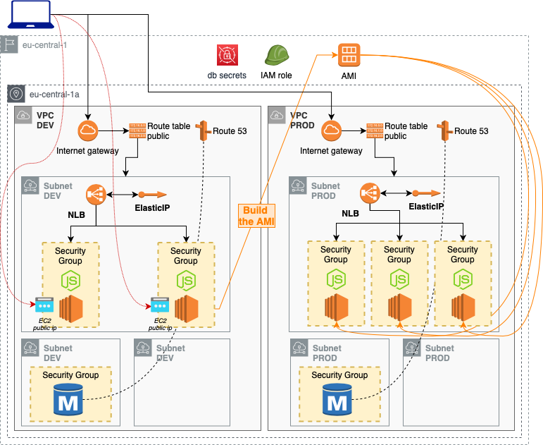

# Deploy Network Load Balancer

Deploy a EC2 with a node.js app and a mySQL RDS instance. Store the db secret in AWS SecretsManager.

This deployment is divided across three folders:
- **./cross**; deploy the AWS SecretsManager and define the IAM role
- **./dev**;
  - ***deploy***: deploy dev environment
  - ***ami***: build AMI for production
- **./prod**: deploy prod environment

## cross

| Resource | Estimated cost (without VAT) | Link |
|------|---------|---------|
| SecretsManager | <0,4$/month per secret - see pricing | [Pricing](https://aws.amazon.com/secrets-manager/pricing/) |

| Automation | Time |
|------|---------|
| terraform apply | 1 min |
| terraform destroy | 1 min |

## dev

### Deploy dev environment

| Resource | Estimated cost (without VAT) | Link |
|------|---------|---------|
| NLB | 0.027 $/h + 0.006 $/h per NLCU-hour | [Pricing](https://aws.amazon.com/elasticloadbalancing/pricing/?nc=sn&loc=3) |
| EC2 | 0,013 $/h x # of instances | [Pricing](https://aws.amazon.com/ec2/pricing/on-demand/) |
| RDS | 0,02 $/h (it can increase if you upload a lot of data, see RDS Storage usage type)| [Pricing](https://aws.amazon.com/rds/mysql/pricing/?pg=pr&loc=2) |
| SecretsManager | <0,4$/month per secret - see pricing | [Pricing](https://aws.amazon.com/secrets-manager/pricing/) |
| Route53 | if deleted within 12h no charges are applied | [Pricing](https://aws.amazon.com/route53/pricing/) |
| Elastic IP | 0 $/h (it costs only if it is not assigned to EC2: 0,05$/h)| [Pricing](https://aws.amazon.com/premiumsupport/knowledge-center/elastic-ip-charges/) |

| Automation | Time |
|------|---------|
| terraform apply | 8 min |
| ansible-playbook | 30 sec |
| terraform destroy | 5 min |

### Create AMI

| Resource | Estimated cost (without VAT) | Link |
|------|---------|---------|
| NLB | 0.027 $/h + 0.006 $/h per NLCU-hour | [Pricing](https://aws.amazon.com/elasticloadbalancing/pricing/?nc=sn&loc=3) |
| EC2 | 0,013 $/h x 2 instances | [Pricing](https://aws.amazon.com/ec2/pricing/on-demand/) |
| RDS | 0,02 $/h (it can increase if you upload a lot of data, see RDS Storage usage type)| [Pricing](https://aws.amazon.com/rds/mysql/pricing/?pg=pr&loc=2) |
| Route53 | if deleted within 12h no charges are applied | [Pricing](https://aws.amazon.com/route53/pricing/) |
| Elastic IP | 0 $/h (it costs only if it is not assigned to EC2: 0,05$/h)| [Pricing](https://aws.amazon.com/premiumsupport/knowledge-center/elastic-ip-charges/) |

| Automation | Time |
|------|---------|
| terraform apply | 8 min |
| ansible-playbook | 30 sec |
| terraform destroy | 5 min |

## prod

| Resource | Estimated cost (without VAT) | Link |
|------|---------|---------|
| NLB | 0.027 $/h + 0.006 $/h per NLCU-hour | [Pricing](https://aws.amazon.com/elasticloadbalancing/pricing/?nc=sn&loc=3) |
| EC2 | 0,013 $/h x 3 instances | [Pricing](https://aws.amazon.com/ec2/pricing/on-demand/) |
| RDS | 0,02 $/h (it can increase if you upload a lot of data, see RDS Storage usage type)| [Pricing](https://aws.amazon.com/rds/mysql/pricing/?pg=pr&loc=2) |
| Route53 | if deleted within 12h no charges are applied | [Pricing](https://aws.amazon.com/route53/pricing/) |
| Elastic IP | 0 $/h (it costs only if it is not assigned to EC2: 0,05$/h)| [Pricing](https://aws.amazon.com/premiumsupport/knowledge-center/elastic-ip-charges/) |

| Automation | Time |
|------|---------|
| terraform apply | 8 min |
| ansible-playbook | 30 sec |
| terraform destroy | 5 min |

<!-- BEGINNING OF PRE-COMMIT-TERRAFORM DOCS HOOK -->
## Requirements

| Name | Version |
|------|---------|
| terraform | >= 0.12.21 |
| aws | >= 2.68 |
| ansible | >= 2.9.1 |

## Providers

| Name | Version |
|------|---------|
| aws | >= 2.68 |

## Inputs

| Name | Description |
|------|---------|
| awsusername | Aws username to tag resources with owner |
| db_username | username for the MySQL db |
| db_password | password for the MySQL db |
| db_private_dns | domain called by the node.js app to call the mysql db |
| db_secret_name | name of the secret to store in AWS SecretsManager |

## Outputs

| Name | Description |
|------|---------|
| ec2_public_ips | vector of public ip of EC2 instances |
| ec2_private_ips | vector of public ip of EC2 instances |
| elastic_public_ip | The public ip of the loadbalancer |

<!-- END OF PRE-COMMIT-TERRAFORM DOCS HOOK -->
