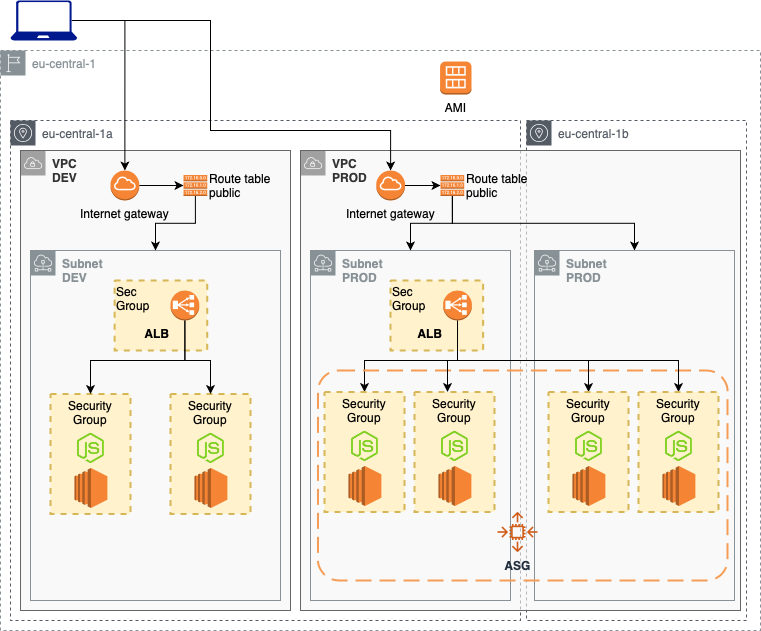
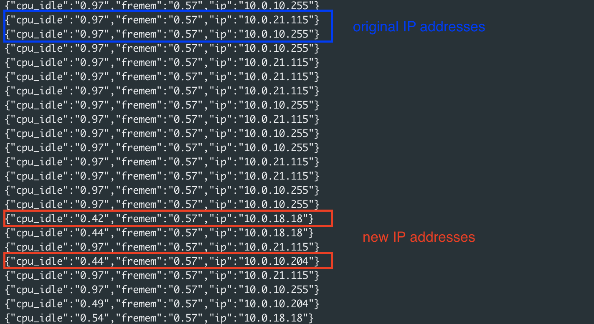

# Use Auto Scaling Group (ASG)

Deploy a node.js app on a development environment with terraform and ansbile.
Build the AMI from the devevlopment environment. Use the AMI to deploy a production environment on an autoscaling group.



This deployment is divided across three folders:
- **./cross**; deploy the keypair to log in EC2 instances
- **./dev**;
  - ***deploy***: deploy dev environment
  - ***ami***: build AMI for production (create_AMI variable set to true)
- **./prod**: deploy prod environment

## cross

| Automation | Time |
|------|---------|
| terraform apply | 3 sec |
| terraform destroy | 3 sec |

## dev

| Resource | Estimated cost (without VAT) | Link |
|------|---------|---------|
| ALB | 0.027 $/h + 0.006 $/h per NLCU-hour | [Pricing](https://aws.amazon.com/elasticloadbalancing/pricing/?nc=sn&loc=3) |
| EC2 | 0,013 $/h x # of instances | [Pricing](https://aws.amazon.com/ec2/pricing/on-demand/) |

| Automation | Time |
|------|---------|
| terraform apply | 2min 15sec |
| ansible-playbook | 40 sec |
| terraform apply (create AMI)| 3min 15sec |
| terraform destroy | 1 min |

## prod

| Resource | Estimated cost (without VAT) | Link |
|------|---------|---------|
| ALB | 0.027 $/h + 0.006 $/h per NLCU-hour | [Pricing](https://aws.amazon.com/elasticloadbalancing/pricing/?nc=sn&loc=3) |
| EC2 | 0,013 $/h x 3 instances | [Pricing](https://aws.amazon.com/ec2/pricing/on-demand/) |

| Automation | Time |
|------|---------|
| terraform apply | 2min 30sec |
| terraform destroy | 2min 15sec |

# Usage

Go to the `./cross` folder and update the `input.tfvars` with your inputs. With this root module we are going to create just the key pair to log in the EC2 instances (both dev and prod environments).
```
terraform init
terraform apply -var-file="input.tfvars"
```

Now go to `./dev` folder and update the `input.tfvars` with your inputs. the `key_pair_name` variable must be the sameone of the `./cross` folder. Check if `create_AMI` is set to `false`. We want only to deploy the development environment, later on we will build the AMI.
```
terraform init
terraform apply -var-file="input.tfvars"
```

You have just deployed the development environment (see VPC DEV in the first picture of this page). Go to `./playbook` folder and deploy the `node.js` application.
```
ansible-playbook -i ./ec2.py ./configure_nodejs.yml -l tag_server_type_fe_server
```

Check if the application is working
```
curl <your-alb-dns>/ip
```
You should receive an answer like this one (with private IP address of your EC2 instance):
```
{"cpu_idle":"0.98","fremem":"0.59","ip":"10.0.13.161"}
```
Now that we tested our application we can create the AMI for production purpose. Go to the `./dev` folder and set to true the `create_AMI` variable in `input.tfvars` then run terraform again
```
terraform init
terraform apply -var-file="input.tfvars"
```

You are ready to deploy your production environment. Update the `input.tfvars` with your own inputs.
```
terraform init
terraform apply -var-file="input.tfvars"
```

To test dynamic ASG effect open another CLI window and run the `callip.sh` script
```
. ./callip.sh <your-production-alb-dns>/ip
```
You should see a number of different private IP addresses equal to asg_desired_capacity (if you run this command to early you will see 503 error from ALB because the first EC2 instances are not still available, just wait a minute).

Now go back to the CLI where you was launching terraform command. Set the asg_desired_capacity to 4, then run terraform apply again.
```
terraform apply -var-file="input.tfvars"
```

In a couple of minutes you will see in the CLI window where you launched `callip.sh` the answer of new IP addresses.
Just update the terraform configuration to test the different behaviours of ASG.



Remember to destroy everything from each folder. Go to `./cross`, `./dev` and `./prod` and launch
```
terraform destroy -var-file="input.tfvars"
```

<!-- BEGINNING OF PRE-COMMIT-TERRAFORM DOCS HOOK -->
## Requirements

| Name | Version |
|------|---------|
| terraform | >= 0.12.21 |
| aws | >= 2.68 |
| ansible | >= 2.9.1 |

## Providers

| Name | Version |
|------|---------|
| aws | >= 2.68 |

## Inputs TO BE UPDATED

| Name | Description |
|------|---------|
| awsusername | Aws username to tag resources with owner |
| db_username | username for the MySQL db |
| db_password | password for the MySQL db |
| db_private_dns | domain called by the node.js app to call the mysql db |
| db_secret_name | name of the secret to store in AWS SecretsManager |

## Outputs TO BE UPDATED

| Name | Description |
|------|---------|
| ec2_public_ips | vector of public ip of EC2 instances |
| ec2_private_ips | vector of public ip of EC2 instances |
| elastic_public_ip | The public ip of the loadbalancer |


<!-- END OF PRE-COMMIT-TERRAFORM DOCS HOOK -->
