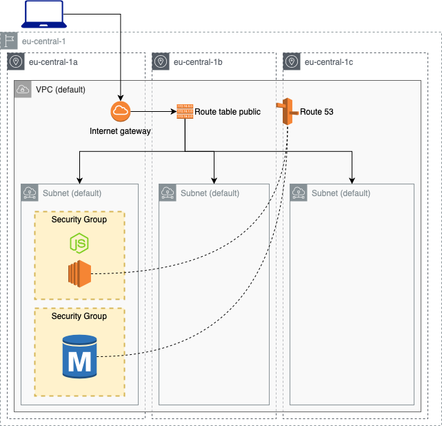
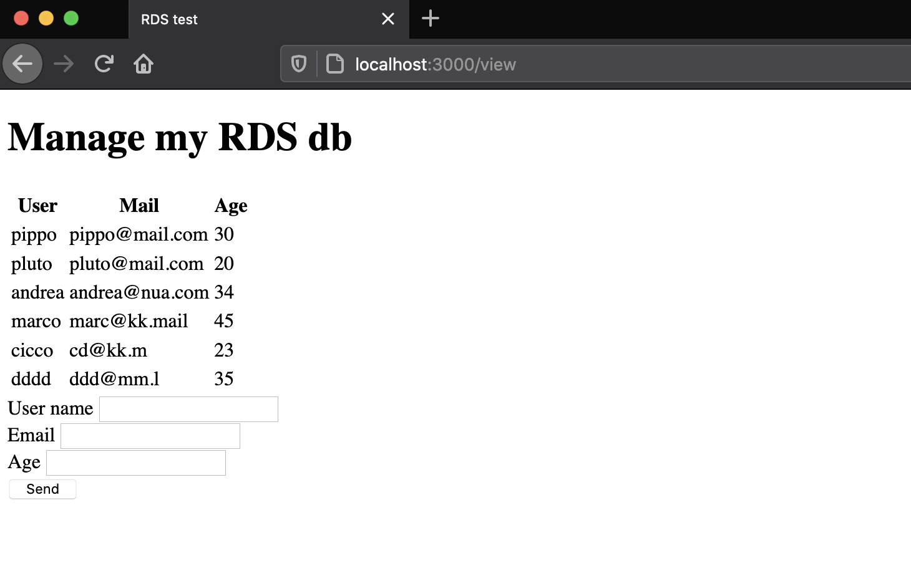

# RDS and EC2

Deploy a EC2 with a node.js app and a mySQL RDS instance.



| Resource | Estimated cost (without VAT) | Link |
|------|---------|---------|
| EC2 | 0,013 $/h x # of instances | [Pricing](https://aws.amazon.com/ec2/pricing/on-demand/) |
| RDS | 0,02 $/h (it can increase if you upload a lot of data, see RDS Storage usage type)| [Pricing](https://aws.amazon.com/rds/mysql/pricing/?pg=pr&loc=2) |
| Route53 | if deleted within 12h no charges are applied | [Pricing](https://aws.amazon.com/route53/pricing/) |

| Automation | Time |
|------|---------|
| Time to deploy (Terraform) | 8 min |
| Time to deploy (Ansible) | 30 sec |
| Time to destroy | 5 min |

## Useful links

[AWS RDS site](https://docs.aws.amazon.com/rds/index.html?nc2=h_ql_doc_rds)

## Usage

### Set db Credentials

Set user and password in `set_db_credentials.sh` script and than run it
```
. ./set_db_credentials.sh
```

Set also `config.service` and `configure_nodejs.yml` with the same inputs of `set_db_credentials.sh`.

Generete your [public ssh key](https://www.ssh.com/ssh/keygen/) and update `main.tf` file with your `id_rsa.pub` in the field `public_key` of the `aws_key_pair` resource.

Now you can deploy the ec2 and the db instance with terraform.

### Deploy EC2 and RDS instance

To run this example you need to execute:

```
$ terraform init
$ terraform plan
$ terraform apply
```

Note that this example may create resources which can cost money (AWS Elastic IP, for example). Run `terraform destroy` when you don't need these resources.

### Deploy node.js app

Before this step you have to deploy the EC2 and the RDS mySQL instance.

If you already updated both `config.service` and `configure_nodejs.yml` just run the following command from the `playbooks` folder (please check if ec2.py is already executable or note, if note run `chmod +x ec2.py`).

```
ansible-playbook -i ./ec2.py ./configure_nodejs.yml -l tag_Name_fe_server
```

On your preferred browser, go to `<EC2-instance-public-ip>:8080/views`, you should see a screen like this (with zero rows because db is still empty).



The main issue of this example is that all the database secrets are stored in a Git repository. This is a bad practice, in the next section you are going to see how to use AWS SecretsManager service to safely store and dynamically retrieve secrets.

## Requirements

| Name | Version |
|------|---------|
| terraform | >= 0.12.21 |
| aws | >= 2.68 |
| ansible | >= 2.9.1 |

## Providers

| Name | Version |
|------|---------|
| aws | >= 2.68 |

## Inputs

| Name | Description |
|------|---------|
| awsusername | Aws username |
| db_username | db username |
| db_password | db password |
| db_private_dns | db private dns name |

## Outputs

| Name | Description |
|------|-------------|
| ec2_public_ip | The public IP of the EC2 instance |
