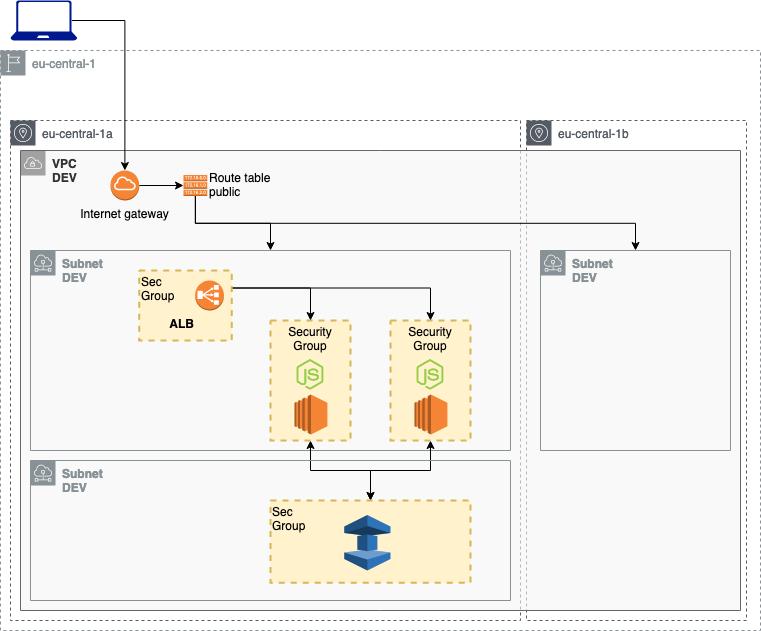

# Use Elasticache (memcache example)

Deploy two EC2 with a node.js app and test Elasticache AWS service (memcache).

| Resource | Estimated cost (without VAT) | Link |
|------|---------|---------|
| ALB | 0.027 $/h + 0.006 $/h per NLCU-hour | [Pricing](https://aws.amazon.com/elasticloadbalancing/pricing/?nc=sn&loc=3) |
| EC2 | 0,013 $/h x # of instances | [Pricing](https://aws.amazon.com/ec2/pricing/on-demand/) |
| MEMCACHE | 0,019 $/h x # of memcache nodes| [Pricing](https://aws.amazon.com/elasticache/pricing/) |

| Automation | Time |
|------|---------|
| terraform apply | 5min 30sec |
| ansible-playbook | 1 min |
| terraform destroy | 5 min |
