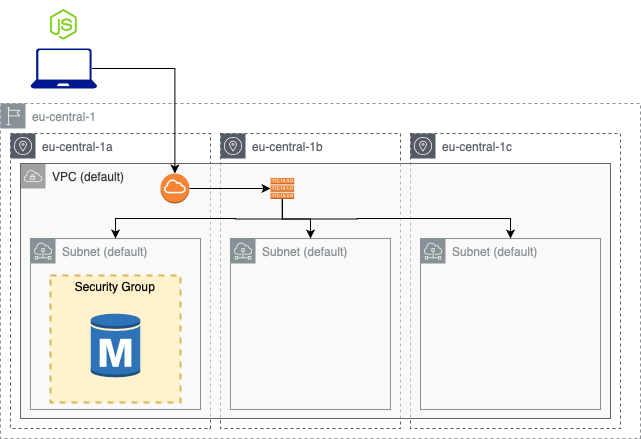

# RDS

Deploy a mySQL RDS instance and use mySQL dbs stored in it through a local node.js application.



| Resource | Estimated cost (without VAT) | Link |
|------|---------|---------|
| RDS | 0,02 $/h (it can increase if you upload a lot of data, see RDS Storage usage type)| [Pricing](https://aws.amazon.com/rds/mysql/pricing/?pg=pr&loc=2) |

| Topic | Data |
|------|---------|
| Time to deploy | 6 min |
| Time to destroy | 4 min |

## Useful links

[AWS RDS site](https://docs.aws.amazon.com/rds/index.html?nc2=h_ql_doc_rds)

## Usage

### Deploy RDS instance

When variables are declared in the root module of your configuration (es. `variable.tf`), they can be set in a number of ways. In this example we are going to use a variable definition file (`.tfvars`).

Update the `input.tfvars` file with your own inputs (es. `example_input.tfvars`).

Initialize terraform root module with all the provider plugins and module needed to run this example:
```
terraform init
```
Verify with `terraform plan` command if everything is ok
```
terraform plan -var-file="input.tfvars"
```
Now you can deploy the db instance with terraform. Remember that at the and of the terraform deployment phase you have to copy/paste the `this_db_instance_endpoint` output variable (without the port number) in `dbsees.js` and `index.js`.

```
terraform apply -var-file="input.tfvars"
```

If you want to print again the outputs after you already run the `terraform apply` command you can just run `terraform output`

Note that this example may create resources which can cost money. When you don't need these resources just run:
```
terraform destroy -var-file="input.tfvars"
```

### Set-up node.js app

Before to do this step you have to deploy an RDS mySQL instance.

If you do not have npm yet installed please follow this [guide](https://docs.npmjs.com/downloading-and-installing-node-js-and-npm).

Update both `dbseed.js` and `index.js` with your RDS inputs:
```
// [LOOK HERE] - Update the code with your data before to run it
const con = mysql.createConnection({
  host: "<your-rds-endpoint>",    // Pick up this value from AWS console or look at the output of terraform apply
  user: "<admin-user-for-db>",    // This must be the same value as the one you set up in your .tfvars file
  password: "<password-for-db>",  // This must be the same value as the one you set up in your .tfvars file
});
```
Run `dbseed.js` to create the table
```
node dbseed.js
```
You should get a message like this
```
OkPacket {
  fieldCount: 0,
  affectedRows: 0,
  insertId: 0,
  serverStatus: 2,
  warningCount: 1,
  message: '',
  protocol41: true,
  changedRows: 0 }
```
Now that you have created the main table you can run your code
```
node index.js
```
On your preferred browser, go to `localhost:3000/view`, you should see a screen like this (with zero rows because it is still empty)


## Requirements

| Name | Version |
|------|---------|
| terraform | >= 0.13.5 |
| aws | >= 2.68 |
| node | >= 10.13.0 |
| npm | >= 6.4.1 |

## Providers

| Name | Version |
|------|---------|
| aws | >= 2.68 |

## Inputs

| Name | Description |
|------|---------|
| awsusername | Aws username |
| db_username | db username |
| db_password | db password |

## Outputs

| Name | Description |
|------|-------------|
| this\_db\_instance\_endpoint | The connection endpoint |
