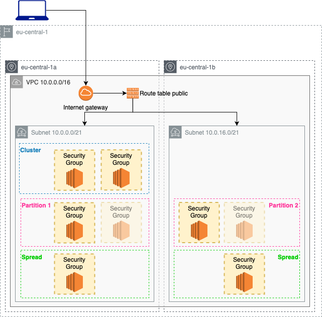

# AWS Placement Groups

Deploy several EC2 instances inside different placement groups. Test different network performances with iperf3 suite.

 

 | Resource | Estimated cost (without VAT) | Link |
 |------|---------|---------|
 | Total cost | 0,522 (0,696) $/h + # of iperf3 test x 0,02 $ | |
 | EC2 | 0,087x6 (8) $/h | [Pricing](https://aws.amazon.com/ec2/pricing/on-demand/) |
 | INTRA Data Transfer (between different AZs) | 0,01 $/GB (each iperf3 test is around 1GB of in and 1GB of out - 0,02 $/iperf3 test) | [Pircing](https://medium.com/@mulupuru/your-comprehensive-guide-to-understanding-aws-data-transfer-costs-f5c8241d65ed) |


***Important:*** data transferred between EC2 instances or containers, or Elastic Network Interfaces across availability zones or VPC peering connections via public, private or Elastic IPv4, or IPv6 addresses is charged at $0.01 per GB for egress traffic and $0.01 per GB for ingress traffic

 | Automation | Time |
 |------|---------|
 | terraform apply | 2min 30sec |
 | ansible | 30sec |
 | terraform destroy | 1min 30sec |

## Usage

Generete your [public ssh key](https://www.ssh.com/ssh/keygen/) and update `main.tf` file with your `id_rsa.pub` in the field `public_key` of the `aws_key_pair` resource.
To run this example you need to execute:

```bash
$ terraform init
$ terraform plan
$ terraform apply
```

Note that this example may create resources which can cost money. Run `terraform destroy` when you don't need these resources.

Now run ansible playbook to install iperf3 on every EC2 instance:
```
ansible-playbook -i ./ec2.py ./configure_volumes.yml -l type_c5a_large
```

### How to test it

All the EC2 instances have public_ip enabled, you will be able to reach all the instances from your workstation (with both `ssh` or `ping` command).

If you log-in you can also try different throughput performances.
Choose one instances for each placement group type. Log-in and run iperf3 as server:
```
iperf3 -s
```

Now log-in on the other instances and launch the client call to the server that you want to test:
```
iperf3 -c <private-ip-of-server-iperf3>
```
You should get the following results:
| EC2 | cluster (a) | spread (b) | partition (b) |
|------|---------|---------|---------|
| cluster (a) | ping:0,2ms - throughput:10Gbits | ping:0,6ms - throughput:5Gbits | ping:0,6ms / throughput:5Gbits |
| spread (a)| ping:0,2ms - throughput:5Gbits | ping:0,6ms - throughput:5Gbits | ping:0,6ms / throughput:5Gbits |
| partition (a)| ping:0,2ms - throughput:5Gbits | ping:0,6ms - throughput:5Gbits | ping:0,6ms / throughput:5Gbits |

<!-- BEGINNING OF PRE-COMMIT-TERRAFORM DOCS HOOK -->
## Requirements

| Name | Version |
|------|---------|
| terraform | >= 0.12.21 |
| aws | >= 2.68 |

## Providers

| Name | Version |
|------|---------|
| aws | >= 2.68 |

## Inputs

No input.

## Outputs

| Name | Description |
|------|-------------|
| public_instance_ip | public ip of the public instance |
| private_instance_ip | public ip of the private instance |
| database_instance_ip | public ip of the database instance |
| public_instance_private_ip | private ip of the public instance |
| private_instance_private_ip | private ip of the private instance |
| database_instance_private_ip | private ip of the database instance |

<!-- END OF PRE-COMMIT-TERRAFORM DOCS HOOK -->
