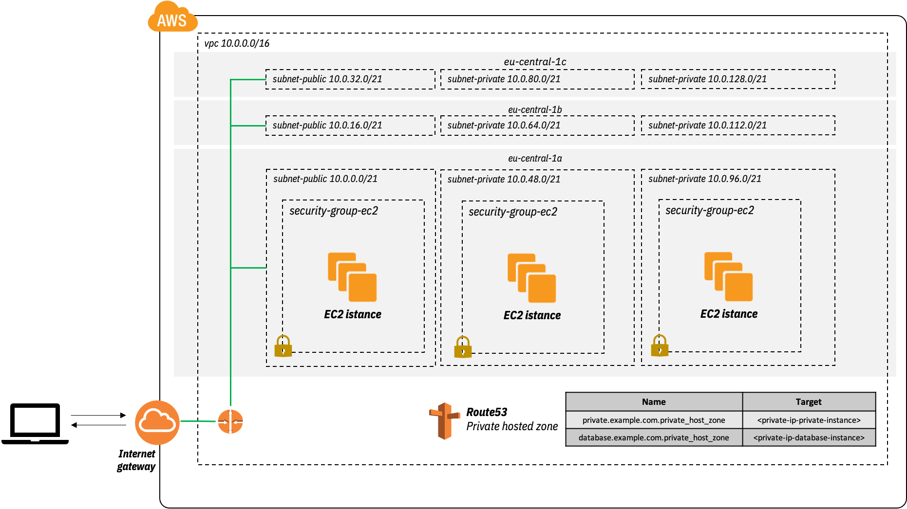

# Website with S3 and Route53

Deploy a custom VPC with Route53 records and simple EC2 instances to test ping and ssh authentication.

 

 | Resource | Estimated cost (without VAT) | Link |
 |------|---------|---------|
 | S3 |  | [Pricing](https://aws.amazon.com/ec2/pricing/on-demand/) |
 | Route53 | if deleted within 12h no charges are applied | [Pricing](https://aws.amazon.com/route53/pricing/) |

 | Automation | Time |
 |------|---------|
 | terraform apply | 2min 30sec |
 | terraform destroy | 1min 30sec |

## Useful links

[AWS: set-up your website with S3](https://docs.aws.amazon.com/Route53/latest/DeveloperGuide/getting-started.html)

[AWS + Terraform: set-up your website with S3](https://medium.com/@dblencowe/hosting-a-static-website-on-s3-using-terraform-0-12-aa5ffe4103e)


## Usage

To run this example you need to execute:

```bash
$ terraform init
$ terraform plan
$ terraform apply
```

Note that this example may create resources which can cost money. Run `terraform destroy` when you don't need these resources.

Go to Route53 dashboard, ***Hosted Zone*** and select the zone that you just created. Copy the name servers of the record type NS (there should be four of them). Now go to Route53 dashboard, ***Registered domain*** and select your domain. Update ***Nameservers*** section with the name servers just copied from the the zone.

### Test

To test S3 type the following URL `http://<your-domain-name>.s3-website.eu-central-1.amazonaws.com`

If it works you have correctly deployed your s3 bucket.
Test the Route53 DNS resolution (remember that for DNS propagation you need at lease 2 days for a new hosted zone) with the follwing URL `http://<your-domain-name>`

<!-- BEGINNING OF PRE-COMMIT-TERRAFORM DOCS HOOK -->
## Requirements

| Name | Version |
|------|---------|
| terraform | >= 0.12.21 |
| aws | >= 2.68 |

## Providers

| Name | Version |
|------|---------|
| aws | >= 2.68 |

## Inputs

No input.

## Outputs

| Name | Description |
|------|-------------|
| public_instance_ip | public ip of the public instance |
| private_instance_ip | public ip of the private instance |
| database_instance_ip | public ip of the database instance |
| public_instance_private_ip | private ip of the public instance |
| private_instance_private_ip | private ip of the private instance |
| database_instance_private_ip | private ip of the database instance |

<!-- END OF PRE-COMMIT-TERRAFORM DOCS HOOK -->
