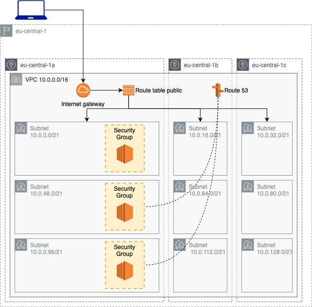

# VPC architecture

Deploy a custom VPC with Route53 records and simple EC2 instances to test ping and ssh authentication.

 

 | Resource | Estimated cost (without VAT) | Link |
 |------|---------|---------|
 | EC2 | 0,013x3 $/h | [Pricing](https://aws.amazon.com/ec2/pricing/on-demand/) |
 | Route53 | if deleted within 12h no charges are applied | [Pricing](https://aws.amazon.com/route53/pricing/) |

 | Automation | Time |
 |------|---------|
 | terraform apply | 2min 30sec |
 | terraform destroy | 1min 30sec |

## Useful links

[AWS VPC site](https://aws.amazon.com/vpc/)

[AWS VPC User Guide](https://docs.aws.amazon.com/vpc/index.html)

[VPC on AWS Quickstart](https://aws-quickstart.github.io/quickstart-aws-vpc/)

[AWS SINGLE VPC DESIGN](http://d0.awsstatic.com/aws-answers/AWS_Single_VPC_Design.pdf)

## Terraform code

If you are new to terraform language read the code of this example, there are many comments that help you understand the basics of this configuration language. Take a moment to read the [terraform documentation](https://www.terraform.io/docs/configuration/index.html).

### What can you find in a terraform folder (aka root module)?
These are the files that you can find in a terraform folder:
- `main.tf`; main file where all the AWS resources are defined
- `variables.tf`; collection of all the terraform variables
- `outputs.tf`; collection of all the terraform output
- `versions.tf`; terraform settings
- `.terraform/`; in this folder terraform will install all the modules and provider plugins
- `terraform.tfstate`; terraform save in this file the remote state of the resources that have been deployed
- `terraform.tfstate.backup`; by default, a backup of the state file is written to this file in case the state file is lost or corrupted to simplify recovery

## Usage

Generete your [public ssh key](https://www.ssh.com/ssh/keygen/) and update `main.tf` file with your `id_rsa.pub` in the field `public_key` of the `aws_key_pair` resource.

To run this example you need to execute:

```bash
$ terraform init
$ terraform plan
$ terraform apply
```

Note that this example may create resources which can cost money. Run `terraform destroy` when you don't need these resources.

### How to test it

All the EC2 instances have public_ip enabled but only public_subnet is routed to the internet gateway. Therefore you will be able to reach only the public instance from your workstation (with both `ssh` or `ping` command).

If you log-in the public instance you can also try the Route53 records. Run the `ping` command using `database.example.com.private_host_zone` or `private.example.com.private_host_zone` instead of the IP address of the instances.

<!-- BEGINNING OF PRE-COMMIT-TERRAFORM DOCS HOOK -->
## Requirements

| Name | Version |
|------|---------|
| terraform | >= 0.12.21 |
| aws | >= 2.68 |

## Providers

| Name | Version |
|------|---------|
| aws | >= 2.68 |

## Inputs

No input.

## Outputs

| Name | Description |
|------|-------------|
| public_instance_ip | public ip of the public instance |
| private_instance_ip | public ip of the private instance |
| database_instance_ip | public ip of the database instance |
| public_instance_private_ip | private ip of the public instance |
| private_instance_private_ip | private ip of the private instance |
| database_instance_private_ip | private ip of the database instance |

<!-- END OF PRE-COMMIT-TERRAFORM DOCS HOOK -->
